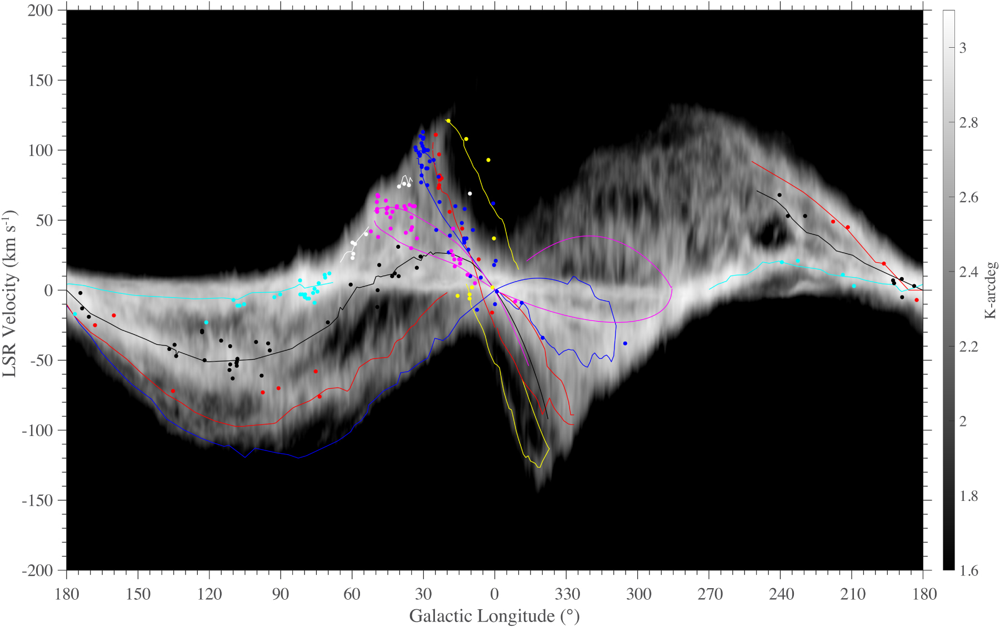
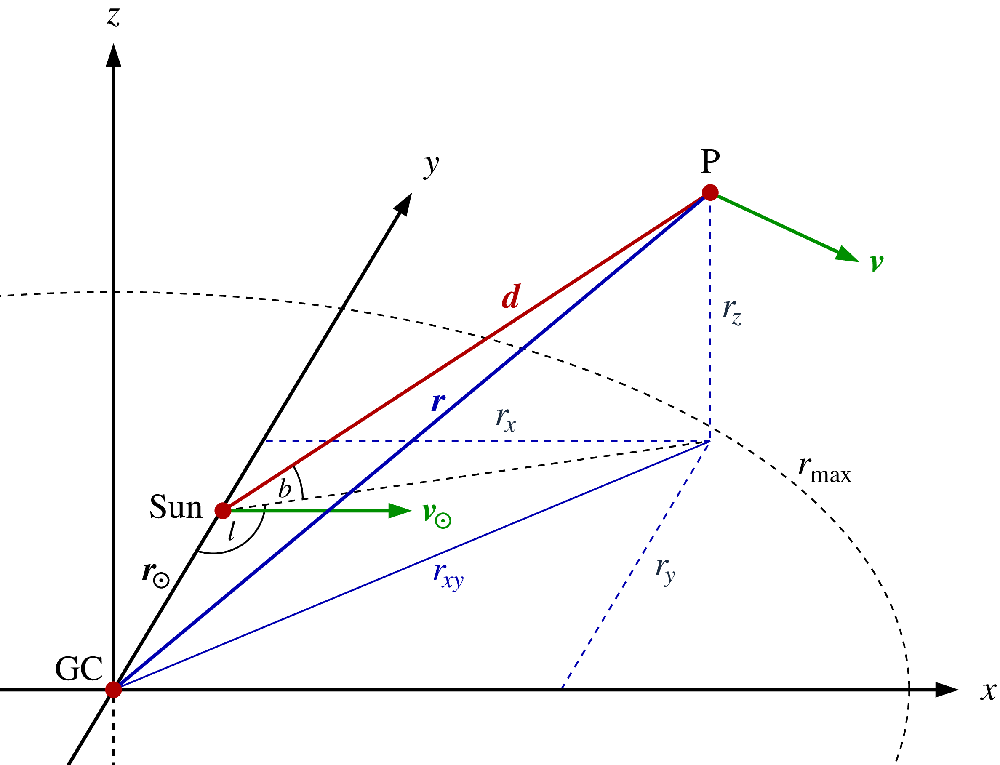
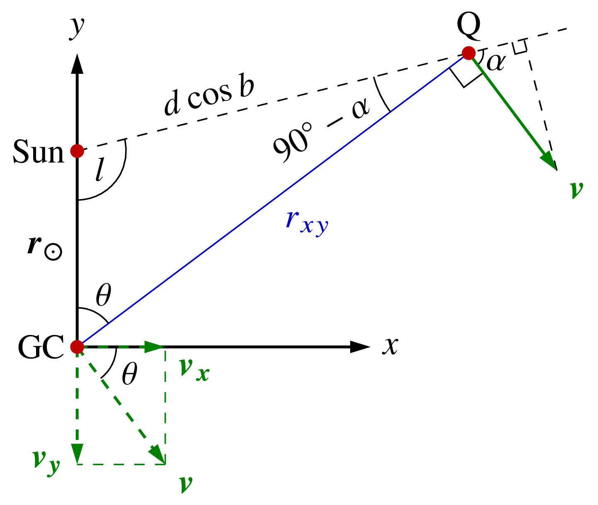
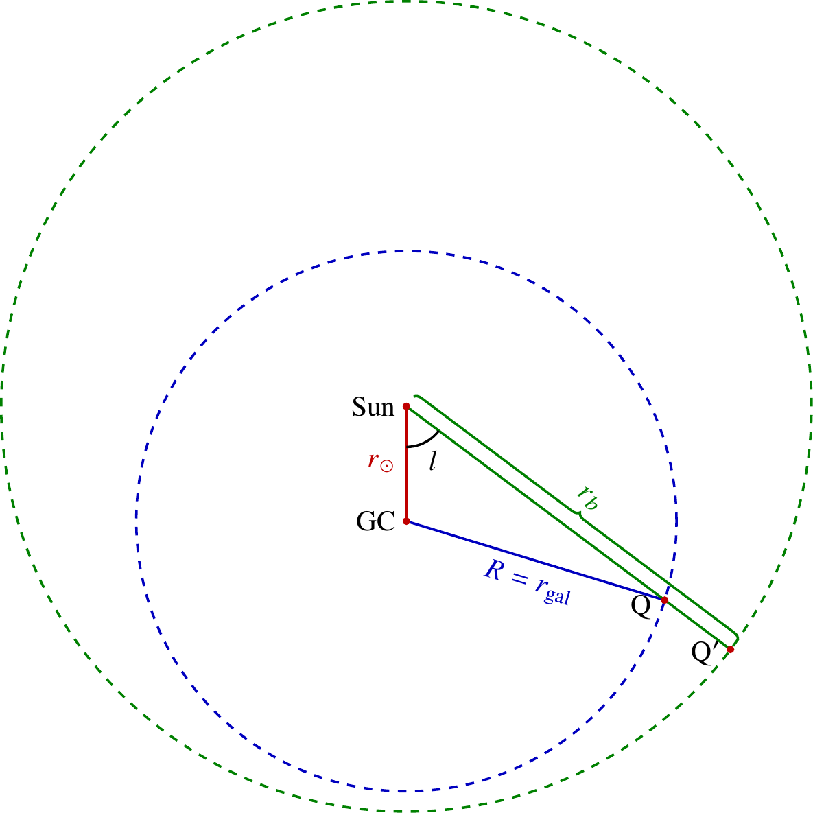
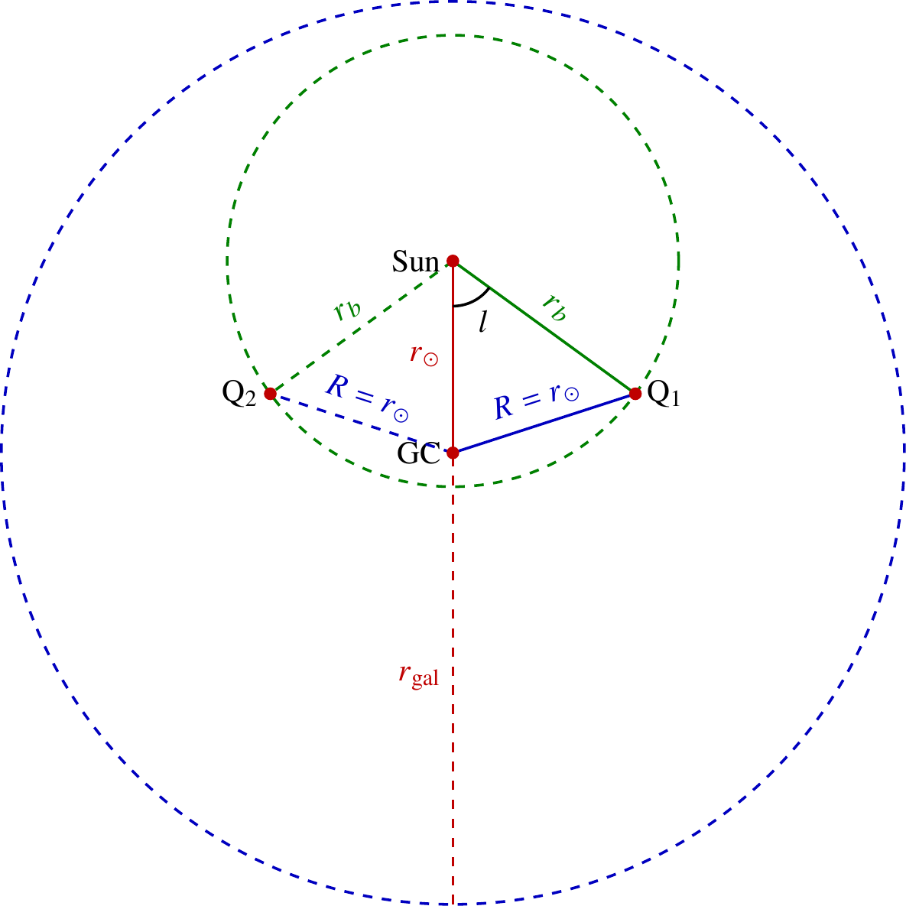
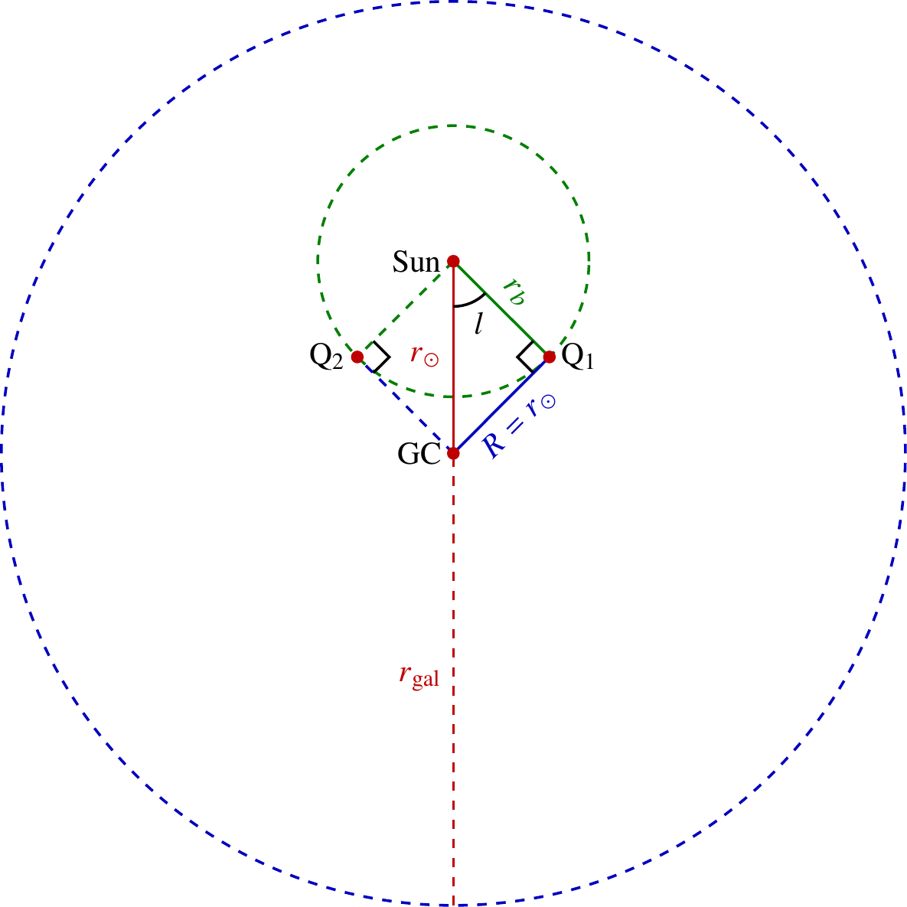
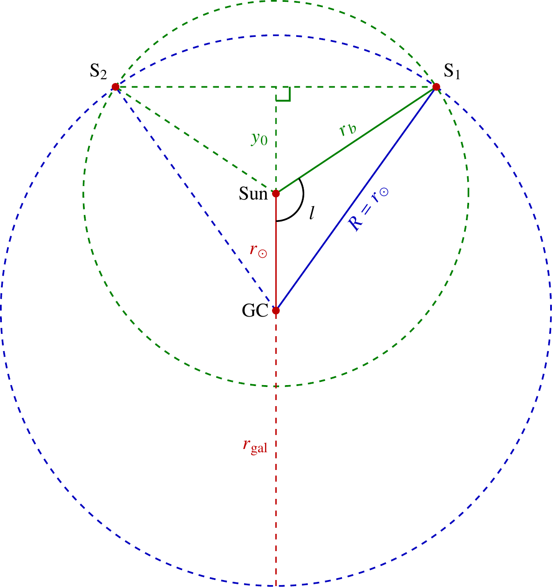
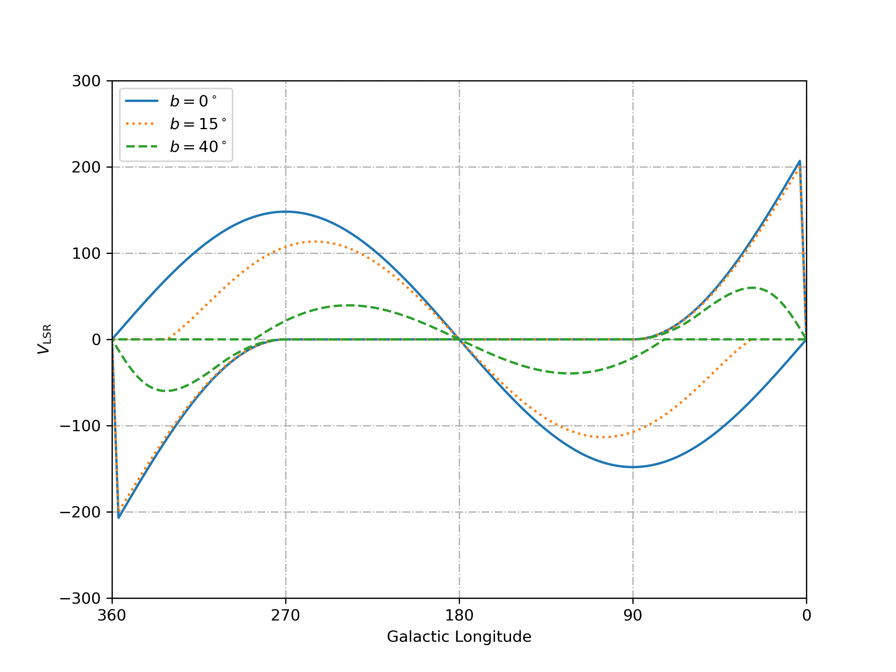

## **前言**

高速云（HVCs，High-velocity clouds）是在银河系的银晕中发现的大量视向速度较高的气体云 [(Wakker & van Woerden 1997)](https://scixplorer.org/abs/1997ARA&A..35..217W/abstract)。传统上认为，在本地静止标准（LSR）中的视向速度超过$70 \sim 90\,\mathrm{km/s}$的气体云是高速云。但我们知道，在以太阳为原点的参考系下，银河系在不同的银经$l$处，旋转的视向速度是不同的，最大速度可以超过$100\,\mathrm{km/s}$，如下图（图源 [(Reid et al. 2019)](https://scixplorer.org/abs/2019ApJ...885..131R/abstract)，HI数据来自LAB巡天，积分范围为$|b| < 5^\circ$）：

而在 [(Wakker 1991)](https://scixplorer.org/abs/1991A&A...250..499W/abstract) 的论文中提出了“偏差速度（deviation velocity）”的概念，也就是将视向速度$v_{\mathrm{LSR}}$与银河系旋转模型对比，考虑在特定的银经$l$和银纬$b$下，银河系旋转速度可能的最大值与最小值（也是绝对值的最大值），完全排除银河系旋转速度的干扰。

这里的偏差速度（deviation velocity）$v_{\mathrm{dev}}$定义如下：
$$
v_{\mathrm{dev}} =
\begin{cases}
    |v_{\mathrm{LSR}} - v_{\mathrm{min}}(l,b)|, & v_{\mathrm{LSR}} < 0 \\
    |v_{\mathrm{LSR}} - v_{\mathrm{max}}(l,b)|, & v_{\mathrm{LSR}} > 0 \\
\end{cases}
$$
即对于任意一个视线坐标$(l,b)$，视向速度在$[v_{\mathrm{min}}(l,b) - v_{\mathrm{dev}},\ v_{\mathrm{max}}(l,b) + v_{\mathrm{dev}}]$的部分都可以被排除。这保证了高速云相对于其附近的星系盘介质的速度一定大于$v_{\mathrm{dev}}$。问题转化为如何确定视线$(l,b)$处银河系旋转速度的最小值与最大值。

这对于大范围巡天的数据处理非常重要。后续在中性氢巡天数据中寻找高速云的研究中普遍采用了这一定义，如HI4PI巡天 [(Westmeier 2018)](https://scixplorer.org/abs/2018MNRAS.474..289W/abstract)、LDS巡天 [(de Heij et al. 2002)](https://scixplorer.org/abs/2002A&A...391..159D/abstract)、HIPASS巡天 [(Putman et al. 2002)](https://scixplorer.org/abs/2002AJ....123..873P/abstract) 等。

## **银河系旋转模型**

### **视向速度的表示**

这一部分的推导来自于 [(Westmeier 2018)](https://scixplorer.org/abs/2018MNRAS.474..289W/abstract) 论文。

在如下的银河系模型中，太阳到银心的距离$r_\odot = 8.5\,\mathrm{kpc}$，太阳的公转速率为$v_\odot = 220\,\mathrm{km/s}$。

银心坐标系中太阳的坐标为$\vec{r}_\odot = (0, r_\odot, 0)$，速度沿$x$轴正方向，即$\vec{v}_\odot = (v_\odot, 0, 0)$。

假设有一个点P跟随银盘旋转运动，在垂直于银盘的方向无速度。P点在银心坐标系中坐标为$\vec{r} = (r_x, r_y, r_z)$，速度为$\vec{v} = (v_x, v_y, 0)$。在太阳坐标系中，太阳指向P的矢量是$\vec{d}$，则P的位置可以用银经$l$、银纬$b$和距离$d$表示为：
$$
\vec{r} = \begin{bmatrix} r_x \\ r_y \\ r_z \end{bmatrix} = \begin{bmatrix} d\sin{l}\cos{b} \\ r_{\odot} - d\cos{l}\cos{b} \\ d\sin{b} \end{bmatrix}
$$
下一步需要知道P对太阳的视向速度$v_{\mathrm{rad}}$。我们需要将速度$\vec{v}$投影到矢量$\vec{d}$上，再将太阳本身的旋转速度分量扣除：
$$
v_{\mathrm{rad}} = \frac{\vec{d} \cdot \vec{v} - \vec{d} \cdot \vec{v}_{\odot}}{|\vec{d}|} = \frac{\vec{d} \cdot (\vec{v} - \vec{v}_{\odot})}{|\vec{d}|} = \frac{(\vec{r} - \vec{r}_{\odot}) \cdot (\vec{v} - \vec{v}_{\odot})}{d}
$$
将$\vec{r}$和$\vec{v}$的坐标表达式代入上式即得：
$$
v_{\mathrm{rad}} = \frac{1}{d} \cdot \begin{bmatrix} d\sin{l}\cos{b} \\ -d\cos{l}\cos{b} \\ d\sin{b} \end{bmatrix} \cdot \begin{bmatrix} v_x - v_\odot \\ v_y \\ 0 \end{bmatrix} = (v_x - v_\odot) \sin{l}\cos{b} - v_y \cos{l}\cos{b}
$$
也可以写为：
$$
v_{\mathrm{rad}} = (v_x\sin{l} - v_y\cos{l}) \cos{b} - v_\odot \sin{l}\cos{b}
$$
下一步证明：
$$
v_x \sin{l} - v_y \cos{l} = v \frac{r_{\odot}}{r_{xy}} \sin{l}
$$

如图，Q为P在银盘平面的投影。在银心、太阳和Q点构成的三角形中，由正弦定理得：
$$
\frac{r_\odot}{\cos{\alpha}} = \frac{r_{xy}}{\cos{l}}
$$
即：
$$
v \frac{r_{\odot}}{r_{xy}} \sin{l} = v \cos{\alpha}
$$
而$v \cos{\alpha}$和$v_x \sin{l} - v_y \cos{l}$都是将$v$投影到太阳与Q的连线上，故：
$$
v \cos{\alpha} = v_x \sin{l} - v_y \cos{l}
$$
证明如下：记太阳与Q对银心的夹角为$\theta = 90^\circ + \alpha - l$，则
$$
v_x = v \cos{\theta} = -v \sin(\alpha - l),\quad v_y = -v \sin{\theta} = -v \cos(\alpha - l)
$$
则：
$$
v_x \sin{l} - v_y \cos{l} = -v \sin(\alpha - l) \sin{l} + v \cos(\alpha - l) \cos{l} = v \cos{\alpha}
$$
这里使用了两角和的余弦公式：
$$
\cos(a + b) = \cos{a} \cos{b} - \sin{a} \sin{b}
$$
于是有：
$$
v_x \sin{l} - v_y \cos{l} = v \cos{\alpha} = v \frac{r_{\odot}}{r_{xy}} \sin{l}
$$
综上所述，视向速度与$l$、$b$和$r_{xy}$的关系为：
$$
v_{\mathrm{rad}} = \left(v \frac{r_{\odot}}{r_{xy}} - v_{\odot}\right) \sin{l}\cos{b}
$$

### **视向速度的最值**

#### **三种典型情况**

现在讨论不同$l$和$b$下，视向速度$v_{\mathrm{rad}}$能达到的最大值和最小值。这是此前的论文中不曾详细讨论的。

为简便起见，记$R = r_{xy}$，则有：
$$
v_{\mathrm{rad}} = \left(\frac{v}{R}r_{\odot} - v_{\odot}\right) \sin{l}\cos{b}
$$
可见不同$l$和$b$下，$v_{\mathrm{rad}}$能达到的最大值和最小值取决于$\dfrac{v}{R}$的最大值和最小值。

我们采用一个圆柱体的银河系旋转模型：设银河系是一个半径为$r_{\mathrm{gal}}$、高度为$2h$的圆柱体，太阳位于$y = r_\odot$处，旋转曲线为常数$v(R) \equiv v_\odot$。此时：
$$
v_{\mathrm{rad}} = v_\odot \left(\frac{r_{\odot}}{R} - 1\right) \sin{l}\cos{b}
$$
则$v_{\mathrm{max}}$对应于$R_{\mathrm{min}}$、$v_{\mathrm{min}}$对应于$R_{\mathrm{max}}$，问题转化为求不同$l$和$b$下，$R = r_{xy}$能达到的最大值和最小值。

基于我们对银河系大小的认识，规定$r_{\mathrm{gal}} > r_\odot$。而位于太阳系的观测者视线扫过的区域为一个顶点在太阳系、半顶角为$90^\circ - b$的圆锥。理论上圆锥高度为无穷大，但我们只考虑圆锥高度为$h$的部分，则圆锥的底面半径为$r_b = h/\tan{b}$。圆锥与圆柱的关系可以反映在底面两个圆$x^2 + y^2 = r_{\mathrm{gal}}^2$与$x^2 + (y-r_\odot)^2 = r_b^2$的位置关系上。

定义：
$$
r_l = \sqrt{r_\odot^2 + r_b^2 - 2r_\odot r_b \cos{l}}
$$
当$\cos{l} = \dfrac{r_b}{2r_\odot}$时，$r_l = r_\odot$；当$\cos{l} = \dfrac{r_b}{r_\odot}$时，$r_l = \sqrt{r_\odot^2 - r_b^2}$。

先不考虑圆锥和圆柱侧面的交线，在$b$不断增大，即$r_b$不断变小的过程中会发生三种典型情况：

1. $r_b = h/\tan{b} > r_{\mathrm{gal}} + r_\odot$：

这是最简单的情况，此时圆锥和圆柱底面没有交线，$R = r_{\mathrm{gal}}$，结论和$b = 0$一样。

$$
R_{\mathrm{min}} =
\begin{cases}
r_\odot |\sin{l}|, & \cos{l} \geqslant 0 \\
r_\odot, & \cos{l} < 0
\end{cases}
$$

$$
R_{\mathrm{max}} =
\begin{cases}
r_{\mathrm{gal}}, & \cos{l} \geqslant 0 \\
r_{\mathrm{gal}}, & \cos{l} < 0
\end{cases}
$$

2. $r_\odot \leqslant r_b = h/\tan{b} < 2r_\odot$

此时存在两个对称点，使得$r_b = r_\odot$，即银心、太阳、Q点构成以银心为顶点的等腰三角形，此时$\cos{l} = \dfrac{r_b}{2r_\odot}$。当$\cos{l} \geqslant \dfrac{r_b}{2r_\odot}$时（如下图，在两个Q点之间），$R \leqslant r_l \leqslant r_\odot$，则$R_{\mathrm{max}} = r_\odot$，$v_{\mathrm{min}} = 0$。

$$
R_{\mathrm{min}} =
\begin{cases}
r_\odot |\sin{l}|, & \cos{l} \geqslant \dfrac{r_b}{2r_\odot} \\
r_\odot |\sin{l}|, & 0 \leqslant \cos{l} < \dfrac{r_b}{2r_\odot} \\
r_\odot, & \cos{l} < 0
\end{cases}
$$

$$
R_{\mathrm{max}} =
\begin{cases}
r_\odot, & \cos{l} \geqslant \dfrac{r_b}{2r_\odot} \\
r_l, & 0 \leqslant \cos{l} < \dfrac{r_b}{2r_\odot} \\
r_l, & \cos{l} < 0
\end{cases}
$$

3. $r_b = h/\tan{b} < r_\odot$

此时银心在以太阳为圆心、$r_b$为半径的圆以外。可以做银心到该圆的切线，在两个切点以内$\cos{l} > \dfrac{r_b}{r_\odot}$，此时太阳到Q的线段上没有点使得$R = r_\odot |\sin{l}|$（因为$r_b < r_\odot \cos{l}$），$R_{\mathrm{min}}$只能取到$r_l$。

$$
R_{\mathrm{min}} =
\begin{cases}
r_l, & \cos{l} \geqslant \dfrac{r_b}{r_\odot} \\
r_\odot |\sin{l}|, & \dfrac{r_b}{2r_\odot} \leqslant \cos{l} < \dfrac{r_b}{r_\odot} \\
r_\odot |\sin{l}|, & 0 \leqslant \cos{l} < \dfrac{r_b}{2r_\odot} \\
r_\odot, & \cos{l} < 0
\end{cases}
$$

$$
R_{\mathrm{max}} =
\begin{cases}
r_\odot, & \cos{l} \geqslant \dfrac{r_b}{r_\odot} \\
r_\odot, & \dfrac{r_b}{2r_\odot} \leqslant \cos{l} < \dfrac{r_b}{r_\odot} \\
r_l, & 0 \leqslant \cos{l} < \dfrac{r_b}{2r_\odot} \\
r_l, & \cos{l} < 0
\end{cases}
$$

#### **圆锥与圆柱相交**

考虑圆锥和圆柱侧面有交线的情况，即以银心为圆心、$r_{\mathrm{gal}}$为半径。如果对于某一个银经$l$，太阳到银河系边缘的距离大于$r_b$，则$R$的最大值无法取到$r_{\mathrm{gal}}$，只能取：
$$
r_l = \sqrt{r_\odot^2 + r_b^2 - 2r_\odot r_b \cos{l}}
$$

圆锥面的半顶角为$90^\circ - b$，圆锥方程为：
$$
z^2 = [x^2 + (y-r_\odot)^2] \tan^2{b}
$$
和圆柱面：
$$
x^2 + y^2 = r_{\mathrm{gal}}^2
$$
的交线为抛物柱面：
$$
z^2 = [r_{\mathrm{gal}}^2 - 2r_\odot y + r_\odot^2] \tan^2{b}
$$
的一部分。

考虑圆$x^2 + y^2 = r_{\mathrm{gal}}^2$与$x^2 + (y-r_\odot)^2 = r_b^2$的交点：
$$
r_{\mathrm{gal}}^2 - 2r_\odot y_0 + r_\odot^2 = r_b^2
$$
即：
$$
y_0 = \frac{r_{\mathrm{gal}}^2 + r_\odot^2 - r_b^2}{2r_\odot}
$$
这对应的银经为：
$$
\cos{l} = \frac{r_\odot - y_0}{r_b}
$$
容易证明：（两边同乘$2r_\odot r_b$，这等价于$r_\odot < r_{\mathrm{gal}}$）
$$
\frac{r_\odot - y_0}{r_b} < \frac{r_b}{2r_\odot}
$$
当$r_{\mathrm{gal}} - r_\odot < r_b < r_{\mathrm{gal}} + r_\odot$时会出现交点。交点的$\cos{l} = 0$对应于：
$$
r_b = \sqrt{r_{\mathrm{gal}}^2 - r_\odot^2}
$$
临界点：
$$
r_{\mathrm{gal}} - r_\odot < r_b < r_{\mathrm{gal}} + r_\odot \\
r_\odot < r_b < 2r_\odot
$$
若$2r_\odot < r_{\mathrm{gal}} < 3r_\odot$（取$r_\odot = 8.5\,\mathrm{kpc}$，即为$17\,\mathrm{kpc} < r_{\mathrm{gal}} < 25.5\,\mathrm{kpc}$），则有：
$$
r_\odot < r_{\mathrm{gal}} - r_\odot < 2r_\odot < r_{\mathrm{gal}} + r_\odot
$$

值得注意的是，当$r_{\mathrm{gal}} > \sqrt{5} r_\odot$时，交点的$\cos{l} = 0$对应于：
$$
r_b = \sqrt{r_{\mathrm{gal}}^2 - r_\odot^2} > 2r_\odot
$$
也就是交点$y_0$从$y_0 < r_\odot$（交点在第一、四象限，此处以太阳为参考系）到$y_0 > r_\odot$（交点在第二、三象限）的变化一定发生在$r_b > 2r_\odot$的阶段。取$r_\odot = 8.5\,\mathrm{kpc}$，则$\sqrt{5} r_\odot \approx 19\,\mathrm{kpc}$。

## **分类讨论**

#### **$r_{\mathrm{gal}} \geqslant 3r_\odot$的情况**

我们先考虑$r_{\mathrm{gal}} \geqslant 3r_\odot$的情况，则：
$$
r_{\mathrm{gal}} + r_\odot > \sqrt{r_{\mathrm{gal}}^2 - r_\odot^2} > r_{\mathrm{gal}} - r_\odot > 2r_\odot > r_\odot
$$
在$b$不断增大，即$r_b$不断变小的过程中会发生如下变化：

1. $r_b \geqslant r_{\mathrm{gal}} + r_\odot$：圆锥和圆柱侧面有交线，但底面没有。

$$
R_{\mathrm{min}} =
\begin{cases}
r_\odot |\sin{l}|, & \cos{l} \geqslant 0 \\
r_\odot, & \cos{l} < 0
\end{cases}
$$

$$
R_{\mathrm{max}} =
\begin{cases}
r_{\mathrm{gal}}, & \cos{l} \geqslant 0 \\
r_{\mathrm{gal}}, & \cos{l} < 0
\end{cases}
$$

2. $\sqrt{r_{\mathrm{gal}}^2 - r_\odot^2} \leqslant r_b < r_{\mathrm{gal}} + r_\odot$：圆锥和圆柱底面有交线，且交线两端点$y_0$位于第一、四象限。

$$
R_{\mathrm{min}} =
\begin{cases}
r_\odot |\sin{l}|, & \cos{l} \geqslant \dfrac{r_\odot - y_0}{r_b} \\
r_\odot |\sin{l}|, & 0 \leqslant \cos{l} < \dfrac{r_\odot - y_0}{r_b} \\
r_\odot, & \cos{l} < 0
\end{cases}
$$

$$
R_{\mathrm{max}} =
\begin{cases}
r_l, & \cos{l} \geqslant \dfrac{r_\odot - y_0}{r_b} \\
r_{\mathrm{gal}}, & 0 \leqslant \cos{l} < \dfrac{r_\odot - y_0}{r_b} \\
r_{\mathrm{gal}}, & \cos{l} < 0
\end{cases}
$$

3. $r_{\mathrm{gal}} - r_\odot \leqslant r_b < \sqrt{r_{\mathrm{gal}}^2 - r_\odot^2}$：圆锥和圆柱底面有交线，且交线两端点$y_0$位于第二、三象限。

$$
R_{\mathrm{min}} =
\begin{cases}
r_\odot |\sin{l}|, & \cos{l} \geqslant 0 \\
r_\odot, & \dfrac{r_\odot - y_0}{r_b} \leqslant \cos{l} < 0 \\
r_\odot, & \cos{l} < \dfrac{r_\odot - y_0}{r_b}
\end{cases}
$$

$$
R_{\mathrm{max}} =
\begin{cases}
r_l, & \cos{l} \geqslant 0 \\
r_l, & \dfrac{r_\odot - y_0}{r_b} \leqslant \cos{l} < 0 \\
r_{\mathrm{gal}}, & \cos{l} < \dfrac{r_\odot - y_0}{r_b}
\end{cases}
$$

4. $2r_\odot \leqslant r_b < r_{\mathrm{gal}} - r_\odot$：圆锥底面完全在圆柱底面内，尚未触发典型情况2。

$$
R_{\mathrm{min}} =
\begin{cases}
r_\odot |\sin{l}|, & \cos{l} \geqslant 0 \\
r_\odot, & \cos{l} < 0
\end{cases}
$$

$$
R_{\mathrm{max}} =
\begin{cases}
r_l, & \cos{l} \geqslant 0 \\
r_l, & \cos{l} < 0
\end{cases}
$$

5. $r_\odot \leqslant r_b < 2r_\odot$：圆锥底面完全在圆柱底面内，触发典型情况2。

$$
R_{\mathrm{min}} =
\begin{cases}
r_\odot |\sin{l}|, & \cos{l} \geqslant \dfrac{r_b}{2r_\odot} \\
r_\odot |\sin{l}|, & 0 \leqslant \cos{l} < \dfrac{r_b}{2r_\odot} \\
r_\odot, & \cos{l} < 0
\end{cases}
$$

$$
R_{\mathrm{max}} =
\begin{cases}
r_\odot, & \cos{l} \geqslant \dfrac{r_b}{2r_\odot} \\
r_l, & 0 \leqslant \cos{l} < \dfrac{r_b}{2r_\odot} \\
r_l, & \cos{l} < 0
\end{cases}
$$

6. $r_b < r_\odot$：圆锥底面完全在圆柱底面内，触发典型情况3。

$$
R_{\mathrm{min}} =
\begin{cases}
r_l, & \cos{l} \geqslant \dfrac{r_b}{r_\odot} \\
r_\odot |\sin{l}|, & \dfrac{r_b}{2r_\odot} \leqslant \cos{l} < \dfrac{r_b}{r_\odot} \\
r_\odot |\sin{l}|, & 0 \leqslant \cos{l} < \dfrac{r_b}{2r_\odot} \\
r_\odot, & \cos{l} < 0
\end{cases}
$$

$$
R_{\mathrm{max}} =
\begin{cases}
r_\odot, & \cos{l} \geqslant \dfrac{r_b}{r_\odot} \\
r_\odot, & \dfrac{r_b}{2r_\odot} \leqslant \cos{l} < \dfrac{r_b}{r_\odot} \\
r_l, & 0 \leqslant \cos{l} < \dfrac{r_b}{2r_\odot} \\
r_l, & \cos{l} < 0
\end{cases}
$$

#### **$\sqrt{5} r_\odot < r_{\mathrm{gal}} < 3r_\odot$的情况**

同理，假设$\sqrt{5} r_\odot < r_{\mathrm{gal}} < 3r_\odot$，则：
$$
r_{\mathrm{gal}} + r_\odot > \sqrt{r_{\mathrm{gal}}^2 - r_\odot^2} > 2r_\odot > r_{\mathrm{gal}} - r_\odot > r_\odot
$$
在$b$不断增大，即$r_b$不断变小的过程中会发生如下变化：

1. $r_b \geqslant r_{\mathrm{gal}} + r_\odot$：圆锥和圆柱侧面有交线，但底面没有。

$$
R_{\mathrm{min}} =
\begin{cases}
r_\odot |\sin{l}|, & \cos{l} \geqslant 0 \\
r_\odot, & \cos{l} < 0
\end{cases}
$$

$$
R_{\mathrm{max}} =
\begin{cases}
r_{\mathrm{gal}}, & \cos{l} \geqslant 0 \\
r_{\mathrm{gal}}, & \cos{l} < 0
\end{cases}
$$

2. $\sqrt{r_{\mathrm{gal}}^2 - r_\odot^2} \leqslant r_b < r_{\mathrm{gal}} + r_\odot$：圆锥和圆柱底面有交线，且交线两端点$y_0$位于第一、四象限。

$$
R_{\mathrm{min}} =
\begin{cases}
r_\odot |\sin{l}|, & \cos{l} \geqslant \dfrac{r_\odot - y_0}{r_b} \\
r_\odot |\sin{l}|, & 0 \leqslant \cos{l} < \dfrac{r_\odot - y_0}{r_b} \\
r_\odot, & \cos{l} < 0
\end{cases}
$$

$$
R_{\mathrm{max}} =
\begin{cases}
r_l, & \cos{l} \geqslant \dfrac{r_\odot - y_0}{r_b} \\
r_{\mathrm{gal}}, & 0 \leqslant \cos{l} < \dfrac{r_\odot - y_0}{r_b} \\
r_{\mathrm{gal}}, & \cos{l} < 0
\end{cases}
$$

3. $2r_\odot \leqslant r_b < \sqrt{r_{\mathrm{gal}}^2 - r_\odot^2}$：圆锥和圆柱底面有交线，且交线两端点$y_0$位于第二、三象限，尚未触发典型情况2。

$$
R_{\mathrm{min}} =
\begin{cases}
r_\odot |\sin{l}|, & \cos{l} \geqslant 0 \\
r_\odot, & \dfrac{r_\odot - y_0}{r_b} \leqslant \cos{l} < 0 \\
r_\odot, & \cos{l} < \dfrac{r_\odot - y_0}{r_b}
\end{cases}
$$

$$
R_{\mathrm{max}} =
\begin{cases}
r_l, & \cos{l} \geqslant 0 \\
r_l, & \dfrac{r_\odot - y_0}{r_b} \leqslant \cos{l} < 0 \\
r_{\mathrm{gal}}, & \cos{l} < \dfrac{r_\odot - y_0}{r_b}
\end{cases}
$$

4. $r_{\mathrm{gal}} - r_\odot \leqslant r_b < 2r_\odot$：圆锥和圆柱底面有交线，且交线两端点$y_0$位于第二、三象限，触发典型情况2。

$$
R_{\mathrm{min}} =
\begin{cases}
r_\odot |\sin{l}|, & \cos{l} \geqslant \dfrac{r_b}{2r_\odot} \\
r_\odot |\sin{l}|, & 0 \leqslant \cos{l} < \dfrac{r_b}{2r_\odot} \\
r_\odot, & \dfrac{r_\odot - y_0}{r_b} \leqslant \cos{l} < 0 \\
r_\odot, & \cos{l} < \dfrac{r_\odot - y_0}{r_b}
\end{cases}
$$

$$
R_{\mathrm{max}} =
\begin{cases}
r_\odot, & \cos{l} \geqslant \dfrac{r_b}{2r_\odot} \\
r_l, & 0 \leqslant \cos{l} < \dfrac{r_b}{2r_\odot} \\
r_l, & \dfrac{r_\odot - y_0}{r_b} \leqslant \cos{l} < 0 \\
r_{\mathrm{gal}}, & \cos{l} < \dfrac{r_\odot - y_0}{r_b}
\end{cases}
$$

5. $r_\odot \leqslant r_b < r_{\mathrm{gal}} - r_\odot$：圆锥底面完全在圆柱底面内，触发典型情况2。

$$
R_{\mathrm{min}} =
\begin{cases}
r_\odot |\sin{l}|, & \cos{l} \geqslant \dfrac{r_b}{2r_\odot} \\
r_\odot |\sin{l}|, & 0 \leqslant \cos{l} < \dfrac{r_b}{2r_\odot} \\
r_\odot, & \cos{l} < 0
\end{cases}
$$

$$
R_{\mathrm{max}} =
\begin{cases}
r_\odot, & \cos{l} \geqslant \dfrac{r_b}{2r_\odot} \\
r_l, & 0 \leqslant \cos{l} < \dfrac{r_b}{2r_\odot} \\
r_l, & \cos{l} < 0
\end{cases}
$$

6. $r_b < r_\odot$：圆锥底面完全在圆柱底面内，触发典型情况3。

$$
R_{\mathrm{min}} =
\begin{cases}
r_l, & \cos{l} \geqslant \dfrac{r_b}{r_\odot} \\
r_\odot |\sin{l}|, & \dfrac{r_b}{2r_\odot} \leqslant \cos{l} < \dfrac{r_b}{r_\odot} \\
r_\odot |\sin{l}|, & 0 \leqslant \cos{l} < \dfrac{r_b}{2r_\odot} \\
r_\odot, & \cos{l} < 0
\end{cases}
$$

$$
R_{\mathrm{max}} =
\begin{cases}
r_\odot, & \cos{l} \geqslant \dfrac{r_b}{r_\odot} \\
r_\odot, & \dfrac{r_b}{2r_\odot} \leqslant \cos{l} < \dfrac{r_b}{r_\odot} \\
r_l, & 0 \leqslant \cos{l} < \dfrac{r_b}{2r_\odot} \\
r_l, & \cos{l} < 0
\end{cases}
$$

#### **$2r_\odot \leqslant r_{\mathrm{gal}} < \sqrt{5} r_\odot$的情况**

下一个情况是$2r_\odot \leqslant r_{\mathrm{gal}} < \sqrt{5} r_\odot$，则：
$$
r_{\mathrm{gal}} + r_\odot > 2r_\odot > \sqrt{r_{\mathrm{gal}}^2 - r_\odot^2} > r_{\mathrm{gal}} - r_\odot > r_\odot
$$
在$b$不断增大，即$r_b$不断变小的过程中会发生如下变化：

1. $r_b \geqslant r_{\mathrm{gal}} + r_\odot$：圆锥和圆柱侧面有交线，但底面没有。

$$
R_{\mathrm{min}} =
\begin{cases}
r_\odot |\sin{l}|, & \cos{l} \geqslant 0 \\
r_\odot, & \cos{l} < 0
\end{cases}
$$

$$
R_{\mathrm{max}} =
\begin{cases}
r_{\mathrm{gal}}, & \cos{l} \geqslant 0 \\
r_{\mathrm{gal}}, & \cos{l} < 0
\end{cases}
$$

2. $2r_\odot \leqslant r_b < r_{\mathrm{gal}} + r_\odot$：圆锥和圆柱底面有交线，且交线两端点$y_0$位于第一、四象限，尚未触发典型情况2。

$$
R_{\mathrm{min}} =
\begin{cases}
r_\odot |\sin{l}|, & \cos{l} \geqslant \dfrac{r_\odot - y_0}{r_b} \\
r_\odot |\sin{l}|, & 0 \leqslant \cos{l} < \dfrac{r_\odot - y_0}{r_b} \\
r_\odot, & \cos{l} < 0
\end{cases}
$$

$$
R_{\mathrm{max}} =
\begin{cases}
r_l, & \cos{l} \geqslant \dfrac{r_\odot - y_0}{r_b} \\
r_{\mathrm{gal}}, & 0 \leqslant \cos{l} < \dfrac{r_\odot - y_0}{r_b} \\
r_{\mathrm{gal}}, & \cos{l} < 0
\end{cases}
$$

3. $\sqrt{r_{\mathrm{gal}}^2 - r_\odot^2} \leqslant r_b < 2r_\odot$：圆锥和圆柱底面有交线，且交线两端点$y_0$位于第一、四象限，触发典型情况2。

$$
R_{\mathrm{min}} =
\begin{cases}
r_\odot |\sin{l}|, & \cos{l} \geqslant \dfrac{r_b}{2r_\odot} \\
r_\odot, & \dfrac{r_\odot - y_0}{r_b} \leqslant \cos{l} < \dfrac{r_b}{2r_\odot} \\
r_\odot, & \cos{l} < \dfrac{r_\odot - y_0}{r_b}
\end{cases}
$$

$$
R_{\mathrm{max}} =
\begin{cases}
r_\odot, & \cos{l} \geqslant \dfrac{r_b}{2r_\odot} \\
r_l, & \dfrac{r_\odot - y_0}{r_b} \leqslant \cos{l} < \dfrac{r_b}{2r_\odot} \\
r_{\mathrm{gal}}, & \cos{l} < \dfrac{r_\odot - y_0}{r_b}
\end{cases}
$$

4. $r_{\mathrm{gal}} - r_\odot \leqslant r_b < \sqrt{r_{\mathrm{gal}}^2 - r_\odot^2}$：圆锥和圆柱底面有交线，且交线两端点$y_0$位于第二、三象限，触发典型情况2。

$$
R_{\mathrm{min}} =
\begin{cases}
r_\odot |\sin{l}|, & \cos{l} \geqslant \dfrac{r_b}{2r_\odot} \\
r_\odot |\sin{l}|, & 0 \leqslant \cos{l} < \dfrac{r_b}{2r_\odot} \\
r_\odot, & \dfrac{r_\odot - y_0}{r_b} \leqslant \cos{l} < 0 \\
r_\odot, & \cos{l} < \dfrac{r_\odot - y_0}{r_b}
\end{cases}
$$

$$
R_{\mathrm{max}} =
\begin{cases}
r_\odot, & \cos{l} \geqslant \dfrac{r_b}{2r_\odot} \\
r_l, & 0 \leqslant \cos{l} < \dfrac{r_b}{2r_\odot} \\
r_l, & \dfrac{r_\odot - y_0}{r_b} \leqslant \cos{l} < 0 \\
r_{\mathrm{gal}}, & \cos{l} < \dfrac{r_\odot - y_0}{r_b}
\end{cases}
$$

5. $r_\odot \leqslant r_b < r_{\mathrm{gal}} - r_\odot$：圆锥底面完全在圆柱底面内，触发典型情况2。

$$
R_{\mathrm{min}} =
\begin{cases}
r_\odot |\sin{l}|, & \cos{l} \geqslant \dfrac{r_b}{2r_\odot} \\
r_\odot |\sin{l}|, & 0 \leqslant \cos{l} < \dfrac{r_b}{2r_\odot} \\
r_\odot, & \cos{l} < 0
\end{cases}
$$

$$
R_{\mathrm{max}} =
\begin{cases}
r_\odot, & \cos{l} \geqslant \dfrac{r_b}{2r_\odot} \\
r_l, & 0 \leqslant \cos{l} < \dfrac{r_b}{2r_\odot} \\
r_l, & \cos{l} < 0
\end{cases}
$$

6. $r_b < r_\odot$：圆锥底面完全在圆柱底面内，触发典型情况3。

$$
R_{\mathrm{min}} =
\begin{cases}
r_l, & \cos{l} \geqslant \dfrac{r_b}{r_\odot} \\
r_\odot |\sin{l}|, & \dfrac{r_b}{2r_\odot} \leqslant \cos{l} < \dfrac{r_b}{r_\odot} \\
r_\odot |\sin{l}|, & 0 \leqslant \cos{l} < \dfrac{r_b}{2r_\odot} \\
r_\odot, & \cos{l} < 0
\end{cases}
$$

$$
R_{\mathrm{max}} =
\begin{cases}
r_\odot, & \cos{l} \geqslant \dfrac{r_b}{r_\odot} \\
r_\odot, & \dfrac{r_b}{2r_\odot} \leqslant \cos{l} < \dfrac{r_b}{r_\odot} \\
r_l, & 0 \leqslant \cos{l} < \dfrac{r_b}{2r_\odot} \\
r_l, & \cos{l} < 0
\end{cases}
$$

#### **$r_\odot < r_{\mathrm{gal}} < 2r_\odot$的情况**

最后一种情况是$r_\odot < r_{\mathrm{gal}} < 2r_\odot$（显然太阳不位于银河系的外部），则：
$$
r_{\mathrm{gal}} + r_\odot > 2r_\odot > \sqrt{r_{\mathrm{gal}}^2 - r_\odot^2} > r_\odot > r_{\mathrm{gal}} - r_\odot
$$
在$b$不断增大，即$r_b$不断变小的过程中会发生如下变化：

1. $r_b \geqslant r_{\mathrm{gal}} + r_\odot$：圆锥和圆柱侧面有交线，但底面没有。

$$
R_{\mathrm{min}} =
\begin{cases}
r_\odot |\sin{l}|, & \cos{l} \geqslant 0 \\
r_\odot, & \cos{l} < 0
\end{cases}
$$

$$
R_{\mathrm{max}} =
\begin{cases}
r_{\mathrm{gal}}, & \cos{l} \geqslant 0 \\
r_{\mathrm{gal}}, & \cos{l} < 0
\end{cases}
$$

2. $2r_\odot \leqslant r_b < r_{\mathrm{gal}} + r_\odot$：圆锥和圆柱底面有交线，且交线两端点$y_0$位于第一、四象限，尚未触发典型情况2。

$$
R_{\mathrm{min}} =
\begin{cases}
r_\odot |\sin{l}|, & \cos{l} \geqslant \dfrac{r_\odot - y_0}{r_b} \\
r_\odot |\sin{l}|, & 0 \leqslant \cos{l} < \dfrac{r_\odot - y_0}{r_b} \\
r_\odot, & \cos{l} < 0
\end{cases}
$$

$$
R_{\mathrm{max}} =
\begin{cases}
r_l, & \cos{l} \geqslant \dfrac{r_\odot - y_0}{r_b} \\
r_{\mathrm{gal}}, & 0 \leqslant \cos{l} < \dfrac{r_\odot - y_0}{r_b} \\
r_{\mathrm{gal}}, & \cos{l} < 0
\end{cases}
$$

3. $\sqrt{r_{\mathrm{gal}}^2 - r_\odot^2} \leqslant r_b < 2r_\odot$：圆锥和圆柱底面有交线，且交线两端点$y_0$位于第一、四象限，触发典型情况2。

$$
R_{\mathrm{min}} =
\begin{cases}
r_\odot |\sin{l}|, & \cos{l} \geqslant \dfrac{r_b}{2r_\odot} \\
r_\odot, & \dfrac{r_\odot - y_0}{r_b} \leqslant \cos{l} < \dfrac{r_b}{2r_\odot} \\
r_\odot, & \cos{l} < \dfrac{r_\odot - y_0}{r_b}
\end{cases}
$$

$$
R_{\mathrm{max}} =
\begin{cases}
r_\odot, & \cos{l} \geqslant \dfrac{r_b}{2r_\odot} \\
r_l, & \dfrac{r_\odot - y_0}{r_b} \leqslant \cos{l} < \dfrac{r_b}{2r_\odot} \\
r_{\mathrm{gal}}, & \cos{l} < \dfrac{r_\odot - y_0}{r_b}
\end{cases}
$$

4. $r_\odot \leqslant r_b < \sqrt{r_{\mathrm{gal}}^2 - r_\odot^2}$：圆锥和圆柱底面有交线，且交线两端点$y_0$位于第二、三象限，触发典型情况2。

$$
R_{\mathrm{min}} =
\begin{cases}
r_\odot |\sin{l}|, & \cos{l} \geqslant \dfrac{r_b}{2r_\odot} \\
r_\odot |\sin{l}|, & 0 \leqslant \cos{l} < \dfrac{r_b}{2r_\odot} \\
r_\odot, & \dfrac{r_\odot - y_0}{r_b} \leqslant \cos{l} < 0 \\
r_\odot, & \cos{l} < \dfrac{r_\odot - y_0}{r_b}
\end{cases}
$$

$$
R_{\mathrm{max}} =
\begin{cases}
r_\odot, & \cos{l} \geqslant \dfrac{r_b}{2r_\odot} \\
r_l, & 0 \leqslant \cos{l} < \dfrac{r_b}{2r_\odot} \\
r_l, & \dfrac{r_\odot - y_0}{r_b} \leqslant \cos{l} < 0 \\
r_{\mathrm{gal}}, & \cos{l} < \dfrac{r_\odot - y_0}{r_b}
\end{cases}
$$

5. $r_{\mathrm{gal}} - r_\odot \leqslant r_b < r_\odot$：圆锥和圆柱底面有交线，且交线两端点$y_0$位于第二、三象限，触发典型情况3。

$$
R_{\mathrm{min}} =
\begin{cases}
r_l, & \cos{l} \geqslant \dfrac{r_b}{r_\odot} \\
r_\odot |\sin{l}|, & \dfrac{r_b}{2r_\odot} \leqslant \cos{l} < \dfrac{r_b}{r_\odot} \\
r_\odot |\sin{l}|, & 0 \leqslant \cos{l} < \dfrac{r_b}{2r_\odot} \\
r_\odot, & \dfrac{r_\odot - y_0}{r_b} \leqslant \cos{l} < 0 \\
r_\odot, & \cos{l} < \dfrac{r_\odot - y_0}{r_b}
\end{cases}
$$

$$
R_{\mathrm{max}} =
\begin{cases}
r_\odot, & \cos{l} \geqslant \dfrac{r_b}{r_\odot} \\
r_\odot, & \dfrac{r_b}{2r_\odot} \leqslant \cos{l} < \dfrac{r_b}{r_\odot} \\
r_l, & 0 \leqslant \cos{l} < \dfrac{r_b}{2r_\odot} \\
r_l, & \dfrac{r_\odot - y_0}{r_b} \leqslant \cos{l} < 0 \\
r_{\mathrm{gal}}, & \cos{l} < \dfrac{r_\odot - y_0}{r_b}
\end{cases}
$$

6. $r_b < r_{\mathrm{gal}} - r_\odot$：圆锥底面完全在圆柱底面内，触发典型情况3。

$$
R_{\mathrm{min}} =
\begin{cases}
r_l, & \cos{l} \geqslant \dfrac{r_b}{r_\odot} \\
r_\odot |\sin{l}|, & \dfrac{r_b}{2r_\odot} \leqslant \cos{l} < \dfrac{r_b}{r_\odot} \\
r_\odot |\sin{l}|, & 0 \leqslant \cos{l} < \dfrac{r_b}{2r_\odot} \\
r_\odot, & \cos{l} < 0
\end{cases}
$$

$$
R_{\mathrm{max}} =
\begin{cases}
r_\odot, & \cos{l} \geqslant \dfrac{r_b}{r_\odot} \\
r_\odot, & \dfrac{r_b}{2r_\odot} \leqslant \cos{l} < \dfrac{r_b}{r_\odot} \\
r_l, & 0 \leqslant \cos{l} < \dfrac{r_b}{2r_\odot} \\
r_l, & \cos{l} < 0
\end{cases}
$$

## **应用**

在论文 [(Wakker 1991)](https://scixplorer.org/abs/1991A&A...250..499W/abstract) 中采用了这样的模型：
$$
r_\odot = 8.5\,\mathrm{kpc},\quad r_{\mathrm{gal}} = 26\,\mathrm{kpc},\quad h = 4\,\mathrm{kpc}
$$
旋转曲线为：
$$
v(R) =
\begin{cases}
    R \times 440\,\mathrm{km/s},\quad 0 \leqslant R < 0.5\,\mathrm{kpc} \\
    220\,\mathrm{km/s},\quad R \geqslant 0.5\,\mathrm{kpc}
\end{cases}
$$
由于在$0 \leqslant R < 0.5\,\mathrm{kpc}$的区间内$\dfrac{v}{R}$为常数（相当于假设这部分的银河系为刚体），上面讨论的结论也适用于该模型。代入计算可以得到与该论文图1相同的图：

使用 [(Reid et al. 2019)](https://scixplorer.org/abs/2019ApJ...885..131R/abstract) 基于 [(Persic et al. 1996)](https://scixplorer.org/abs/1996MNRAS.281...27P/abstract) 给出的通用旋转曲线模型（其中$r_\odot = 8.15\,\mathrm{kpc}$），设：
$$
r_{\mathrm{gal}} = 20\,\mathrm{kpc},\quad h = 5\,\mathrm{kpc}
$$
如下图，可以发现与HI4PI巡天得到的速度图（背景图，积分范围为$|b| < 10^\circ$）非常吻合：

## **讨论**

### **模型变种**

该模型有一些不同的变种：

- 非常数的旋转曲线：目前公认最准确的旋转曲线模型是 [(Reid et al. 2019)](https://scixplorer.org/abs/2019ApJ...885..131R/abstract) 基于 [(Persic et al. 1996)](https://scixplorer.org/abs/1996MNRAS.281...27P/abstract) 给出的通用旋转曲线模型，其余的模型还有 [(Russeil et al. 2017)](https://scixplorer.org/abs/2017A&A...601L...5R/abstract) 给出的幂律模型和 [(Zhou et al. 2023)](https://scixplorer.org/abs/2023ApJ...946...73Z/abstract) 给出的直线模型等。理论上我们需要将$\dfrac{v(R)}{R}$看作整体求极值，此时$R$的取值即为上面讨论的$[R_{\mathrm{min}}, R_{\mathrm{max}}]$，在这个范围内解出极值后代入$v(R)$计算旋转速度。但实际上只要$\dfrac{v(R)}{R}$在$R > 0$时单调减小，即可直接对$R$求极值。考虑幂函数近似，设$v \propto R^k$，$\dfrac{v(R)}{R}$在$R > 0$时单调减小等价于$k \leqslant 1$，这也意味着$v(R)$在$R > 0$时是（开口向下的）凸函数。从观测上讲，一般的旋转曲线模型都符合这一条件，因此可以直接通过求$R$的极值获得$v$的极值。
- 考虑银河系边缘比中间厚，例如 [(van Woerden et al. 2004)](https://scixplorer.org/abs/2004ASSL..312.....V/abstract) 第2.1节使用的边缘抛物线模型：
  $$
  z_{\mathrm{max}} =
  \begin{cases}
  1\,\mathrm{kpc},\quad R < r_\odot \\
  \left[1 + \dfrac{(R/r_\odot - 1)^2}{2}\right]\,\mathrm{kpc},\quad R > r_\odot
  \end{cases}
  $$
  旋转曲线使用的是 [(Wakker 1991)](https://scixplorer.org/abs/1991A&A...250..499W/abstract) 的模型。先计算$R_{\mathrm{max}}$再计算$v_{\mathrm{max}}$。
- 论文 [(de Heij, Braun, & Burton 2002)](https://scixplorer.org/abs/2002A&A...391..159D/abstract) 在圆柱体模型的基础上加入了气体沿$z$轴的分布（使用了一个高斯分布）和银盘的翘曲（$\phi$为以银心为原点，沿银河系旋转方向增加的角度坐标，太阳对应于$\phi=180^\circ$）：
  $$
  z = \left(\frac{R - 11.5}{6}\right)\sin\phi + 0.3\left(\frac{R - 11.5}{6}\right)^2 (1 - 2\cos\phi)
  $$
  然而这个模型的旋转曲线使用的是$v(R) \equiv 220\,\mathrm{km/s}$的常数。这样的模型使用数值解法计算$[v_{\mathrm{min}}, v_{\mathrm{max}}]$是最合适的。